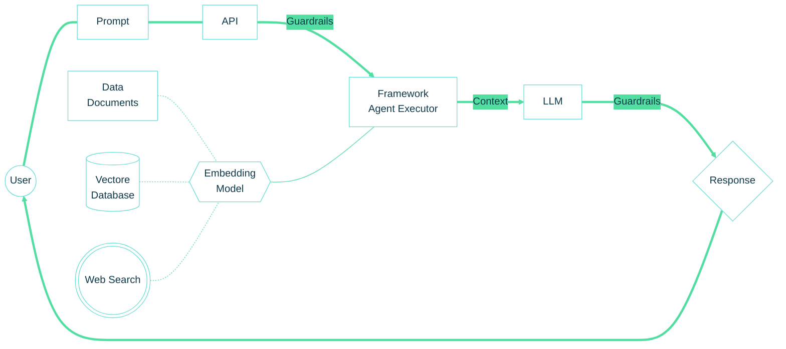

```mermaid
%%{
  init: {
    'theme': 'base',
    'themeVariables': {
      'primaryColor': '#ffffff',
      'primaryTextColor': '#0f3849',
      'primaryBorderColor': '#62ddd6',
      'lineColor': '#52dea0',
      'secondaryColor': '#52dea0',
      'tertiaryColor': '#6ccbef'
    }
  }
}%%
flowchart LR;
    id0((User)) === id1[Prompt];

    id1 ===  API ==> | Guardrails | id2[Framework\n Agent Executor] 
   
    id2 ==>| Context | LLM
    LLM  ===> | Guardrails | id7{Response} 

    id3 --- id2
    id3{{Embedding\n Model}} 
    id4[Data\n Documents] -.- id3
    id5[(Vectore\n Database)] -.- id3
    id6(((Web Search))) -.- id3
    
    id7 ==> id0

```
