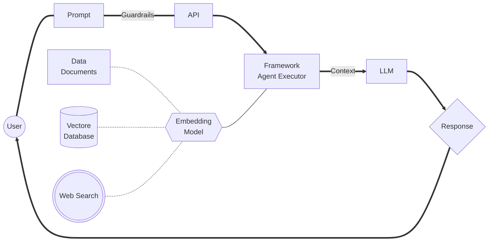

%%{
  init: {
    'theme': 'base',
    'themeVariables': {
      'primaryColor': '#034172',
      'primaryTextColor': '#fff',
      'primaryBorderColor': '#7C0000',
      'lineColor': '#52dea0',
      'secondaryColor': '#52dea0',
      'tertiaryColor': '#6ccbef'
    }
  }
}%%

